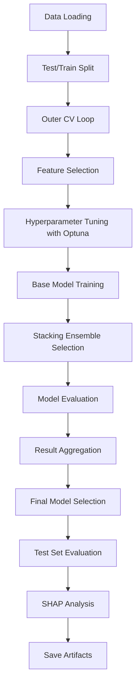

# StackedML-Perovskites 🔬🔮

StackedML-Perovskites is a sophisticated machine learning pipeline designed for the analysis and prediction of perovskite materials properties. This project implements a stacking ensemble approach with nested cross-validation, feature selection, and Optuna-based hyperparameter tuning, supporting both regression and classification tasks.

## Table of Contents
- [Project Overview](#project-overview)
- [Key Concepts](#key-concepts)
- [Models](#models)
- [Project Structure](#project-structure)
- [Dataset](#dataset)
- [Installation](#installation)
- [Usage](#usage)
- [Pipeline Workflow](#pipeline-workflow)
- [Configuration](#configuration)
- [Contributing](#contributing)
- [License](#license)

## Project Overview 🌟

Perovskite materials hold immense promise for applications like solar cells and LEDs. This project aims to provide a comprehensive machine learning solution for material scientists and researchers working with perovskites. By leveraging advanced techniques like stacking ensembles and nested cross-validation, it facilitates the prediction of material properties, aiding in the discovery and optimization of new materials.

The pipeline addresses two main tasks:
- **Regression**: Predicting continuous material properties with metrics like R² and MAE
- **Classification**: Categorizing materials with metrics like Accuracy and ROC-AUC

## Key Concepts 🧠

### Stacking Ensemble Learning
Stacking combines multiple base models through a meta-learner that uses the predictions of base models as input features. This approach often achieves better performance than any single model.

### Nested Cross-Validation
The pipeline implements a nested CV approach. This technique is crucial as it provides a less biased estimate of the model's generalization performance compared to simple cross-validation, especially when hyperparameter tuning is involved.
- **Outer CV**: Evaluates the entire modeling pipeline.
- **Inner CV**: Used within each outer fold for hyperparameter tuning (Optuna) and model selection.

### Feature Selection Methods
The pipeline supports multiple feature selection approaches:
- **LightGBM-based**: Uses feature importance from LightGBM models
- **K-Best**: Selects top K features based on statistical tests
- **Mutual Information**: Captures non-linear relationships between features and targets

### Hyperparameter Optimization
**Optuna** is used for efficient hyperparameter tuning. It explores different parameter combinations to find the best model configuration.
- **Optimization Metrics**: Optimizes based on R²/MAE for regression and ROC-AUC/Accuracy for classification.
- **Trials**: Configurable number of optimization attempts.
- **Pruning**: Early stopping of poorly performing trials to save computation time.

### Interpretability
**SHAP (SHapley Additive exPlanations)** provides model interpretability by:
- Calculating feature contributions to individual predictions
- Visualizing global feature importance
- Helping understand model decision-making process

## Models 🤖

The pipeline employs a stacking ensemble strategy, combining predictions from multiple diverse base models using a meta-learner.

### Base Models
The selection includes a variety of algorithms (tree-based, linear, neural networks, distance-based) to capture different patterns in the data, improving the robustness and accuracy of the ensemble.

#### Regression Models
| Model | Description | Hyperparameters Tuned |
|-------|-------------|----------------------|
| LightGBM | Gradient boosting framework using tree-based learning | learning_rate, num_leaves, max_depth, etc. |
| XGBoost | Optimized gradient boosting library | eta, max_depth, subsample, etc. |
| Random Forest | Ensemble of decision trees | n_estimators, max_depth, min_samples_split |
| Ridge | Linear regression with L2 regularization | alpha |
| MLP | Multi-layer perceptron neural network | hidden_layer_sizes, activation, solver |
| KNN | K-nearest neighbors regression | n_neighbors, weights, p |

#### Classification Models
| Model | Description | Hyperparameters Tuned |
|-------|-------------|----------------------|
| LightGBM | Gradient boosting framework using tree-based learning | learning_rate, num_leaves, max_depth, etc. |
| XGBoost | Optimized gradient boosting library | eta, max_depth, subsample, etc. |
| Random Forest | Ensemble of decision trees | n_estimators, max_depth, min_samples_split |
| Logistic Regression | Linear model for classification | C, penalty, solver |
| MLP | Multi-layer perceptron neural network | hidden_layer_sizes, activation, solver |
| SVC | Support vector classification | C, kernel, gamma |

### Meta-Models

The meta-learners combine base model predictions and selects the best meta-model based on performance:

#### For Regression
- Ridge Regression
- Gradient Boosting Regressor
- LightGBM Regressor

#### For Classification
- Logistic Regression
- Random Forest Classifier
- LightGBM Classifier

## Project Structure 📁

| File | Description |
|------|-------------|
| `main.py` | Entry point for the pipeline execution |
| `model_definitions.py` | Defines all models, Optuna optimization functions, and stacking logic |
| `outer_cv.py` | Implements the nested cross-validation procedure |
| `pipeline_steps.py` | Contains functions for the later stages of the ML pipeline (evaluation, SHAP, saving) |
| `config.py` | Central configuration settings for the entire pipeline |
| `utils.py` | Utility functions used across the project |
| `test.py` | Contains test scripts or functions for verifying components |
| `requirements.txt` | Lists required Python dependencies |
| `synthetic_data.csv` | Sample dataset for testing and demonstrating the pipeline |
| `flowchart-*.md/.txt` | Detailed visual explanations of specific pipeline parts |

## Dataset 📊

The pipeline is demonstrated using the `synthetic_data.csv` file included in the repository. 

For real-world applications, you can adapt the pipeline by:
1. Modifying the `DATA_FILE` variable in `config.py` to point to your dataset.
2. Ensuring your data is appropriately formatted (e.g., CSV with features and target columns).
3. Adjusting configuration parameters (like `STRATIFY_SPLIT`) based on your data characteristics.

## Installation 💻

To install the required dependencies, run:

```bash
pip install -r requirements.txt
```

## Usage 🚀

To execute the pipeline, run the `main.py` script from the project's root directory:

```bash
python main.py
```

Output artifacts, including saved models, selected features lists, and cross-validation results, will be saved to the directory specified by `OUTPUT_DIR` in `config.py` (default is `results/`).

## Pipeline Workflow 🔄



### Key Pipeline Steps

1. **Data Loading & Preprocessing**: Load data, split into train/validation/test sets
2. **Outer CV Loop**: Iterate through each fold for robust evaluation
3. **Feature Selection**: Apply selected method to identify important features
4. **Hyperparameter Tuning**: Use Optuna to optimize model parameters
5. **Base Model Training**: Train individual models with optimized parameters
6. **Stacking Ensemble Selection**: Build and select best stacking ensemble
7. **Result Aggregation**: Combine results across all CV folds
8. **Final Model Selection**: Choose best-performing models from CV results
9. **Test Set Evaluation**: Evaluate final models on unseen test data
10. **SHAP Analysis**: Generate interpretability insights
11. **Save Artifacts**: Persist models, features, and results

## Configuration ⚙️

Configuration settings are managed in `config.py`. Key parameters include:

| Parameter | Description |
|-----------|-------------|
| `FEATURE_SELECTION_METHOD` | Method for selecting important features |
| `N_SPLITS_OUTER_CV` | Number of folds for outer cross-validation |
| `STACKING_CV_FOLDS` | Number of folds for inner cross-validation |
| `OPTUNA_TRIALS_MAIN` | Number of trials for main model optimization |
| `TUNE_ALL_BASE_MODELS` | Whether to tune all base models or only key ones |
| `SHAP_BACKGROUND_SAMPLES` | Number of samples for SHAP background |
| `SAVE_MODELS` | Flag to save trained models |
| `SAVE_FEATURES` | Flag to save selected features |
| `SAVE_RESULTS` | Flag to save cross-validation results |

## Contributing 🤝

Contributions are welcome! Please fork the repository and submit a pull request.

## License 📝

This project is currently in progress.
