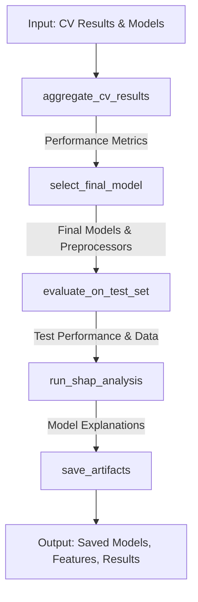

# Machine Learning Pipeline Steps Flowchart

This document explains the logic and workflow of the ML pipeline implemented in `pipeline_steps.py`. This file contains the key functions that make up the later stages of the machine learning pipeline for perovskite materials analysis.

## Pipeline Overview

The `pipeline_steps.py` module contains functions for the following key stages of the machine learning pipeline:

1. **Aggregating Cross-Validation Results** - Function: `aggregate_cv_results()`
2. **Selecting Final Models** - Function: `select_final_model()`
3. **Evaluating on Test Set** - Function: `evaluate_on_test_set()`
4. **SHAP Interpretability Analysis** - Function: `run_shap_analysis()`
5. **Saving Artifacts** - Function: `save_artifacts()`

These functions are designed to be called sequentially, with each step building on the results of the previous one. The pipeline handles both regression and classification tasks simultaneously.

## Detailed Function Workflows

### 1. `aggregate_cv_results()`

**Purpose**: Calculates and reports the average cross-validation performance metrics across all folds.

**Input**:
- `outer_fold_results_reg`: Dictionary with lists of regression metrics per fold
- `outer_fold_results_cls`: Dictionary with lists of classification metrics per fold

**Workflow**:
1. For regression metrics (R2, MAE):
   - Calculates mean and standard deviation across all folds
   - Handles NaN values gracefully
2. For classification metrics (Accuracy, ROC-AUC):
   - Calculates mean and standard deviation across all folds
   - Handles NaN values gracefully
3. Prints formatted results for all metrics
4. Returns tuple of (mean_r2, std_r2, mean_mae, std_mae, mean_acc, std_acc, mean_roc_auc, std_roc_auc)

### 2. `select_final_model()`

**Purpose**: Selects the best performing models and their associated preprocessing components from cross-validation folds.

**Input**:
- CV results dictionaries
- Lists of models, scalers, and selectors from all folds
- Configuration parameters

**Workflow**:
1. Identifies best regression fold based on R2 score
2. Identifies best classification fold based on ROC-AUC score
3. Retrieves models and components from best folds:
   - Final regressor and classifier
   - Scaler and feature selector from best regression fold
   - Selected features list
4. Instantiates fresh models with best parameters
5. Returns tuple of (final_regressor, final_classifier, preprocessing_components, fold_indices)

### 3. `evaluate_on_test_set()`

**Purpose**: Evaluates final models on unseen test data using consistent preprocessing.

**Input**:
- Test data (X_test, y_test_reg, y_test_cls)
- Final models and preprocessing components
- Feature names and configuration

**Workflow**:
1. Preprocessing pipeline:
   - Applies final scaler to test data
   - Applies feature selection using final selector
   - Creates DataFrame with selected features
2. Regression evaluation:
   - Generates predictions
   - Calculates R2, MAE, RMSE
3. Classification evaluation:
   - Generates predictions and probabilities
   - Calculates accuracy and ROC-AUC
4. Returns processed test data for SHAP analysis

### 4. `run_shap_analysis()`

**Purpose**: Generates model interpretability analysis using SHAP values.

**Input**:
- Final models
- Processed test data
- Training data for background
- Model configuration and parameters

**Workflow**:
1. Background data preparation:
   - Samples from best fold's training set
   - Applies consistent preprocessing
2. Test data sampling for efficiency
3. Regression SHAP analysis:
   - Creates KernelExplainer
   - Generates summary plots
4. Classification SHAP analysis:
   - Creates KernelExplainer with probability predictions
   - Generates summary plots

### 5. `save_artifacts()`

**Purpose**: Persists all relevant model artifacts to disk.

**Input**:
- Final models
- Selected features
- CV results
- Configuration parameters

**Workflow**:
1. Creates output directory structure
2. Saves models (if enabled):
   - Regression model (joblib format)
   - Classification model (joblib format)
3. Saves features (if enabled):
   - List of selected features (text format)
4. Saves results (if enabled):
   - CV results for both tasks (CSV format)

## Pipeline Data Flow



## Configuration Dependencies

The pipeline uses these key configuration variables from `config.py`:

```python
SAVE_MODELS = True          # Control model persistence
SAVE_FEATURES = True        # Control feature list persistence
SAVE_RESULTS = True         # Control CV results persistence
SHAP_BACKGROUND_SAMPLES = 50  # Samples for SHAP background
SHAP_EXPLAIN_SAMPLES = 20     # Test samples to explain
OUTPUT_DIR = 'results'        # Artifact storage location
```

## Error Handling and Logging

Each function implements:
- Graceful handling of missing or invalid inputs
- Detailed progress logging
- Clear error messages for debugging
- Fallback behavior when operations fail

## Notes

- All functions support both regression and classification tasks
- Preprocessing steps are consistently applied across all data splits
- SHAP analysis adapts to model capabilities (e.g., predict_proba availability)
- Results and artifacts are saved in standardized formats
- Configuration flags control optional operations
